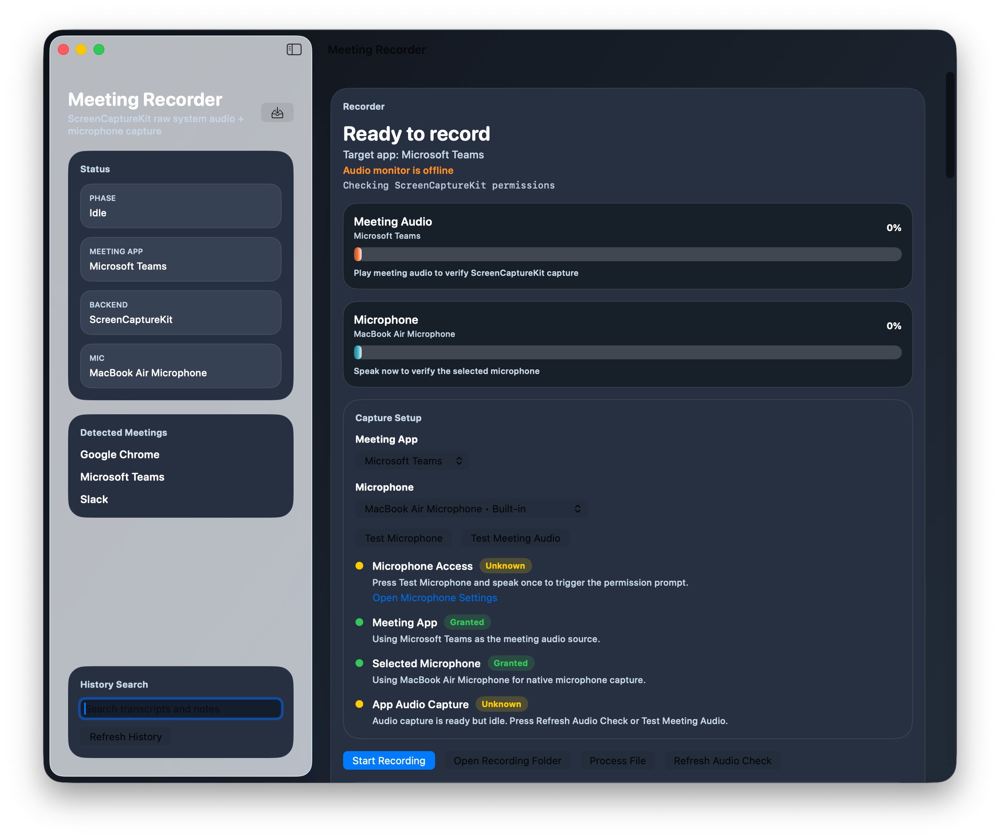

# Meeting Recorder

A native macOS SwiftUI app for recording meetings, transcribing them with `whisper-cli`, and generating meeting notes with Claude.



## Features

- Record meeting audio with native ScreenCaptureKit system audio capture plus microphone input
- Show live audio meters for both meeting audio and microphone input
- Detect common meeting apps like Teams, Zoom, Meet, Slack, Webex, and FaceTime
- Transcribe recordings with local Whisper models through `whisper-cli`
- Generate structured meeting notes with the Claude CLI
- Recover transcript-only meetings and re-generate notes from the UI
- Process existing recordings by importing or dragging in audio/video files

## Requirements

- macOS 15 or later
- `whisper-cli` installed and available in one of:
  - `~/.local/bin`
  - `~/bin`
  - `/opt/homebrew/bin`
  - `/usr/local/bin`
- `claude` CLI installed and authenticated

## Build

Debug build:

```bash
swift build
```

Universal release app:

```bash
xcodebuild \
  -project MeetingRecorder.xcodeproj \
  -scheme "Meeting Recorder" \
  -configuration Release \
  -destination 'platform=macOS' \
  -derivedDataPath .derived-data-release-universal \
  ARCHS='arm64 x86_64' \
  ONLY_ACTIVE_ARCH=NO \
  build
```

Release app bundle:

```bash
.derived-data-release-universal/Build/Products/Release/Meeting\ Recorder.app
```

Zip for transfer:

```bash
ditto -c -k --sequesterRsrc --keepParent \
  ".derived-data-release-universal/Build/Products/Release/Meeting Recorder.app" \
  "MeetingRecorder-universal.zip"
```

## Setup

1. Install `whisper-cli`.
2. Install and log into the Claude CLI.
3. Make sure a Whisper model exists, for example:
   `~/.local/share/whisper-models/ggml-small.bin`
4. Launch the app and grant:
   - Microphone access
   - Screen Recording access

## Storage

Meetings are stored under:

```text
~/Documents/meetings/YYYY-MM-DD_HH-MM-SS/
```

Typical files:

- `recording.mov`
- `audio.wav` or imported audio
- `transcript.txt`
- `notes.md`
- `meeting.meta`

## Notes

- Finder-launched builds do not inherit your shell `PATH`, so the app searches common user, Homebrew, and system bin directories itself.
- If macOS says the copied app is "damaged", it is usually a quarantine/signing warning. Zip the app before transfer, or remove quarantine on the destination Mac.
